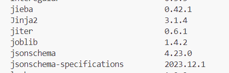
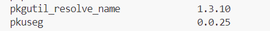

# web_info
## sec1
对数据进行处理
### 分词
#### 工具一 jieba
项目地址：https://github.com/fxsjy/jieba?tab=readme-ov-file


测试结果，搜索引擎模式最好


#### 工具二 pkuseg
项目地址：https://github.com/lancopku/pkuseg-python

#### 对比
经过对比，pku的工具效果更好，其“装B”、“港台”可以成功分词，而jieba不太可以


### 去除停用词
使用哈工大停用词表

对停用词匹配并删除
### 去除符号
使用
```python
word = "".join(re.findall('([\u4e00-\u9fa5]|[\u0061,\u007a]|[\u0041,\u005a])+', word, re.S))
```
仅匹配中英文，去除其他一切符号
### 近义词合并
已完成，使用预训练的word2vec模型，将词表内的同义词合并（注意，合并可能在不同书间存在差异，如书本A '爱''喜欢'将合并为'爱'，B可能合并为'喜欢'），所以在倒序建表时可能需要再次合并同义词。

模型地址：https://blog.csdn.net/Artoria_QZH/article/details/103299140
### 额外添加繁体字转换器
github地址：https://github.com/skydark/nstools/tree/master/zhtools

**注**：src中数据处理文件为`data_process.py`对其余的**可能**存在依赖，勿动

## sec2
建立倒排索引表

### 建立过程

首先使用词法分析器解析输入数据，得到文档和其对应的标签。

使用 std::map （红黑树）来存储倒排索引表的标签，每个标签对应一个链表，即该标签所对应的文档。

对于链表可以采取不同的数据结构以增加查询性能。

### 数据结构

#### SkipList 介绍
论文地址 [Skip lists: a probabilistic alternative to balanced trees](https://dl.acm.org/doi/10.1145/78973.78977)


SkipList 在普通链表上添加不同层次的跳表指针，层次越高指针每次所跳距离越远。在查调表时，从最高层出发，逐层向下查。

例如对于上图 SkipList 查找 17，比较路径是 6 -> NIL -> 25 -> 9 -> 17.


一般希望每层指针都是其下层的一半或者更少, 如上图达到最佳情况，在该表查找一个元素仅需 $\Theta(\log n)$ 时间，存储该表也仅需要 $\Theta(n)$ 的空间。 这样的跳表是良好的数据结构，可以达到和红黑树类似的性能，并且储存读取方便。

为了在跳表插入节点而不至于退化成链表，必须要确保插入前后每层的指针分布均匀。经典的做法是对每个插入的节点产生一个指数分布的随机层数，可以证明这样能够保持 $\Theta(\log n)$ 的查找性能。

在源码中实现了第一张图所示结构的动态跳表 SkipList，支持创建和插入操作。

#### **StaticSkipList**

SkipList 在数据集上的表现不好，因为所有标签比文档数量多得多，每个 SkipList 都需要一定空间来存储头节点，这包含 MaxLevel 个指针，即使很多 SkipList 根本就只有一个节点。（在假定输入数据是动态时，MaxLevel 必须提前定好而不能过小，否则一个有很多节点的 SkipList 查找性能会很差）。

SkipList 一方面浪费很多空间，一方面存储困难，因为指针在每次运行时是一个动态值，无法直接存入文件或从文件加载，并且对于超大规模数据，没有办法从磁盘交换出仅需要的节点进行查找。

考虑到输入数据集实际上是静态的，由此得到对数据存储空间和磁盘 IO 进行了针对性优化的 StaticSkipList。

例如对数据 0, 1, 2, 3, 4 的原始 SkipList


StaticSkipList 的示例结构为


其左上角为节点编号，不实际存储。

StaticSkipList 的实际存储结构为


不同编号的节点依次排列。

总体来说，StaticSkipList 依照如下方式对原始 SkipList 进行优化，它是从图二这样分离的十字链表数据结构优化而来。

- 因为知道条目总数，可以计算出节点数，故不使用链表而是用数组存储。
- 每个节点存储的指针数据替换为数组索引。
- 每个节点仅拥有两个 int 数据，right 和 down，其中 right 指向右侧节点，down 指向下层节点。
- 考虑到数组索引和文档索引都是非负数，通过在 down 最高位设置 0 或 1, 能够区分 down 中存储的是数组索引还是数据，故无需额外空间存储数据。考虑到对齐问题，StaticSkipList 每个节点占 8 个字节，而图二 SkipList 占 24 个字节。
- 严格按照每两个节点设置一个上层节点的方式建表。
- 删除表中多余的节点，例如图中条目 4 应该有 2 个节点，由于上层节点 right 只能为 0（没有右侧节点了），所以去掉它。整张表仅允许最后一个条目的底层节点 right 这一个 int 为空，其它变量全部拥有值。
- 每个数组索引都指向其目标条目的顶层节点，在要顺序查询多个值时，这可以用于从上一个值所在地方快速恢复到顶层，这对 AND 查询非常有效。
- 每个条目从上至下顺序存在数组中。

为了进一步节省空间，可以每 4 或者 16 个节点设置一个上层节点。这样不会影响建表的性能。

顺序存储并非不利于大规模数据存储的操作，相反，StaticSkipList 在数据规模很大时查询性能并不差。

由于顺序索引存储，索引表可以直接二进制存储到文件中，或同样从文件中读取。在需要查询时，right 所记录的索引偏移直接就是下一个节点所在文件中位置，它在每个条目的查询只需加载本条目的节点和下一个条目的顶层节点。

#### **StringSkipList**

StringSkipList 在空间和访问效率上对 StaticSkipList 进行了优化，它的想法类似于对图一的链表数组化。

首先是 StaticSkipList 的 down 数据，其无论存储索引还是数组，最终目标都是为了获得本节点所在条目的数据。

为此可以每个节点都存储数据，而不存储任何索引，如下图


如此可以在同样空间的情况下极大加快数据查找。

但这样数据就在同一条目的每个节点中存在重复。如果将数据提前到条目的首部，其它节点均只存储其它条目的索引，就得到下图


它就是图 1 数组化的朴素结果。这个表有一个问题，当做 AND 查找，需要遍历该表时，必须得走一个条目的
所有节点才能到下一个条目。为此可以将每个条目的第一个索引提前，得到 StringSkipList



此时可以方便的查找和遍历。

### 结果对比

||原始数据|StaticSkipList|StringSkipList|
|---|---|---|---|
|book_processed_by_jieba|1569KB|2534KB|1980KB|
|book_processed_by_pkuseg|1540KB|2573KB|2005KB|
|movie_processed_by_jieba|5665KB|8637KB|6700KB|
|movie_processed_by_pkuseg|5700KB|8781KB|6815KB|
|selected_book_top_1200_data_tag|2263KB|2873KB|2332KB|
|selected_movie_top_1200_data_tag|8781KB|11044KB|8850KB|

由于 SkipList 的索引数据实际上是稀疏的，可以通过压缩显著减低空间占用。

## sec3
### 所做更新

在SkipList_next 分支，只对SkipList这一文件夹做了提交（不是src文件夹里的SkipList，是外面的skiplist文件夹）

主函数为SkipList_process.cpp，运行环境为Visual Studio2022，C++ version：C++20

可下载到本地，双击 .sln工程文件运行程序

### 功能示例

1.输出示例

2.查询单独一个标签并返回相关书籍（或电影）的ID



3.查询两个标签都满足的相关书籍（或电影）（即A AND B）


4.查询两个标签至少满足其一的相关书籍（或电影）（即A OR B）


5.复杂查询

由离散数学 数理逻辑，复杂查询可分为AND，OR，NOT的组合操作（对应合取 $\wedge$ ，析取 $\vee$ ，否定 $\neg$）

可提示用户输入 AND内容 OR内容 以及NOT内容

例如，用户想查询中国当代青春或校园的书籍，但不能出现血腥元素；则可以在AND处输入 中国 当代，在OR处输入 校园 青春，在NOT处输入 血腥

代表(中国&当代)&(青春or校园) but NOT血腥，按照这个逻辑完成对跳表的处理

示例如下：


